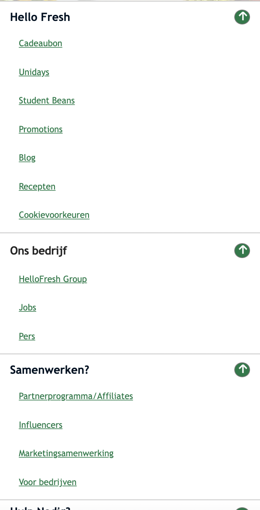

# Procesverslag
Markdown is een simpele manier om HTML te schrijven.  
Markdown cheat cheet: [Hulp bij het schrijven van Markdown](https://github.com/adam-p/markdown-here/wiki/Markdown-Cheatsheet).

Nb. De standaardstructuur en de spartaanse opmaak van de README.md zijn helemaal prima. Het gaat om de inhoud van je procesverslag. Besteedt de tijd voor pracht en praal aan je website.

Nb. Door *open* toe te voegen aan een *details* element kun je deze standaard open zetten. Fijn om dat steeds voor de relevante stuk(ken) te doen.

## Jij

  
uitwerken voor kick-off werkgroep

  ### Auteur:
  Taurese Usman (vervangen door jouw naam)

  #### Je startniveau:
  Blauw (kies uit zwart, rood óf blauw)

  #### Je focus:
  Responsive (kies uit responsive óf surface plane)
 

## Je website

  
uitwerken voor kick-off werkgroep

  ### Je opdracht:
  https://www.hellofresh.nl/

  #### Screenshot(s) van de eerste pagina (small screen): 
  Homepage
   
  

  #### Screenshot(s) van de tweede pagina (small screen):
  Samenduurzaam

  
 

## Toegankelijkheidstest 1/2 (week 1)

  
uitwerken na test in 1e werkgroep

  ### Bevindingen
  Lijst met je bevindingen die in de test naar voren kwamen:

  #### Screenreader
Met een screenreader is de website goed te gebruiken je krijgt alle info goed mee. Alle tekst, navigatie, headers en titels worden goed uitgelegd. Alleen de h1 op de page werd niet goed uitgesproken en herhaalde zichzelf continu.

  #### Muis en Toetsenbord 
Met de muis worden alle klik-bare functies ge-highlight, wanneer je op een button of een carrousel hovert dan krijg word deze een andere kleur en krijgt deze een zwaardere border. 

Hier heeft Hello Fresh goed rekening mee gehouden. 

Tab en enter werken allebei goed, je kan de website hier goed mee bedienen. Alle klik-bare opties worden hiermee snel bereikt bereik.

Met de tab knop kan je direct door de gehele website navigeren en met de enter kan je naar de geselecteerde subpagina komen (die je met de tab hebt geselecteerd).

  #### Motoriek (shocks, elastiekjes)
Slecht motoriek is de website goed te gebruiken, dit is omdat de buttons erg groot zijn. 
Omdat je op de praktisch niet hoeft te typen op de website maakt dit het erg makkelijk. 
Ook is het lezen van de content op de pagina erg nog steeds erg goed te doen. 

Met spasmes of Parkinson’s is de website lastig te gebruiken, maar niet onmogelijk. Omdat de buttons erg groot zijn is het nog mogelijk om hier op te kunnen klikken.  Wel was het navigeren met spasmes erg moeilijk met een hand, maar met twee zou dit nog moeilijker zijn om te gebruiken. 

  #### Concentratie problemen
Concentratieprobleem
Met concentratie problemen is deze website niet zo goed te gebruiken. Dit is omdat de website heel rustig is en geen aandacht trekt wanneer jij met iets andere bezig bent. Er zijn geen onderdelen op de pagina die erg uitspatten. 

  #### Visueel (brillen, contrast, kleurenblind, dark/light). 
Voor mensen met kleurenblind word er best goed rekening gehouden, wanneer er met colorblindly word gekeken dan worden de andere kleuren erg ge-highlight of de kleuren zelfs veranderd. 

Behalve bij de Green-Week of Green-Blind, hierbij zie je geen verschil met de originele website. 

Verder is met een visuele beperking de website nog redelijk goed te gebruiken, dit is omdat er heel veel afbeeldingen zijn op de pagina en dat er goed gebruik is gemaakt van flexbox, alle tekst is opgedeeld in verschillende stukken.

## Breakdownschets (week 1)

  
uitwerken na afloop 2e werkgroep

  ### de hele pagina: 
  

  ### dynamisch deel (bijv menu): 
  

  ### wellicht nog een dynamisch deel (bijv filter): 
  

## Voortgang 1 (week 2)

  
uitwerken voor 1e voortgang

  ### Stand van zaken
  hier dit ging goed & dit was lastig (neem ook screenshots op van delen van je website en code)

  ### Agenda voor meeting
  samen met je groepje opstellen

  | Taurese        | Brianne            | Lars         | student 4        |
  | ---            | ---                | ---          | ---              |
  | List item op   | en dit             | Hoe kan ik   | en dan ik dat    |
  | een timer die  | dit als er tijd is | het beste be |                  |
  | ginnen met cs  | ...                | ginnen met-css|                 |
  
 
  
  De agenda bewerken gaat erg lastig dus ik zet alle dingen hier neer:
  
  Taurese:  Ik weet niet hoe ik een list item laten veranderen op een timer die loopt. 
  
  
  Brianne:  Ik kan niet altijd :nth-of-child gebruiken. Bijv. als ik de 1e section een background-image wil geven. Wat moet ik dan doen? (zelfde met       
  links).
  
  
  Lars: Hoe kan ik het beste beginnen met CSS.

  ### Verslag van meeting
  hier na afloop snel de uitkomsten van de meeting vastleggen:
  
Ik heb van de student assistentes een mogelijke oplossing meegekregen voor mijn probleem, ik zou dit kunnen fixen met CSS of met Autotype of TypeJS. Ik zal dit zo spoedig mogelijk toepassen binnen mijn site. Verder gaat het erg goed met mijn website en ben ik al redelijk ver opweg.
  

## Voortgang 2 (week 3)

  
uitwerken voor 2e voortgang

  ### Stand van zaken
  hier dit ging goed & dit was lastig (neem ook screenshots op van delen van je website en code)

  ### Agenda voor meeting
  samen met je groepje opstellen

  | Taurese       | student 2          | student 3    | student 4        |
  | ---            | ---                | ---          | ---              |
  | dit bespreken  | en dit             | en ik dit    | en dan ik dat    |
  | en dat ook nog | dit als er tijd is | nog een punt | dit wil ik zeker |
  | ...            | ...                | ...          | ...              |

  
  De agenda bewerken gaat erg lastig dus ik zet alle dingen hier neer:
  
  Taurese: Ik weet niet hoe ik meerdere dropdown UL's kan maken binnen een footer. 

  Brianne: Heeft het zelfde probleem als ik. 

  Lars: had geen voortgang gemaakt en had niets op te vragen bij de les
  
  

  ### Verslag van meeting
  - hier na afloop snel de uitkomsten van de meeting vastleggen
  Na afloop van het gesprek heb ik de footer kunnen toepassen binnen de website (deze hadden we gemaakt). Dit heeft mij erg opweg geholpen en hierdoor heb ik weer goed verder kunnen werken. 

## Toegankelijkheidstest 2/2 (week 4)

  
uitwerken na test in 8e werkgroep

### Bevindingen

#### Slechte motoriek
Slecht motoriek is de website ook goed te gebruiken. Dit is omdat de website verticaal goed te gebruiken is, je hoeft niet op (veel) buttons te klikken om te komen waar je wilt zijn.

#### Visuele beperkingen
De website is goed te gebruiken met een visuele beperking, dit is omdat er veel afbeeldingen zijn die veel ruimte innemen. Alleen de tekst op mijn website kan een stukje groter, dit is nu nog best klein.

#### Concentratieprobleem
Met concentratie problemen is de website nog redelijk te gebruiken. Dit is wederom omdat er veel grote afbeeldingen op de pagina zijn die al een voorbeeld geven van wat de sectie inhoud. 

#### Spasmes/Parkinson
Met parkinsons is de website goed te gebruiken. Dit is omdat de website veel informatie en afbeeldingen heeft en niet veel dingen waar je hoeft te klikken. 

#### Screenreaders
Met de screenreaders is de pagina erg goed te gebruiken. Dit is omdat ik op bijna alle elementen een aria-label heb toegevoegd die uitlegt wat de content inhoud (sections, kopjes, woorden, afbeeldingen, buttons, links).
Ook heb ik het probleem van de eerste keer verbeterd (de h1 bleef zich herhalen).

  

## Voortgang 3 (week 4)

  
uitwerken voor 3e voortgang

  ### Stand van zaken
  hier dit ging goed & dit was lastig (neem ook screenshots op van delen van je website en code)

  ### Agenda voor meeting
  samen met je groepje opstellen

  | student 1      | student 2          | student 3    | student 4        |
  | ---            | ---                | ---          | ---              |
  | dit bespreken  | en dit             | en ik dit    | en dan ik dat    |
  | en dat ook nog | dit als er tijd is | nog een punt | dit wil ik zeker |
  | ...            | ...                | ...          | ...              |

  ### Agenda meeting
  
  Taurese: Ik weet niet hoe ik de header die we in de les hebben gemaakt er goed uit kan laten zien op de desktop versie. En dat mijn navigatie voor een of andere reden niet opent op mijn tweede pagina desondanks de code precies hetzelfde is (css & javascript).

  Brianne: Ik heb “ik wil graag weten hoe ik iconen (images) verander als de grootte van mijn scherm verandert met JavaScript en Css, en of het semantisch correct is om meerdere p’s onder elkaar te hebben of dat daar een andere mogelijkheid voor is. Als laatste wil ik mijn foto’s en tekstgroottes responsive maken.”

  Lars: Ik heb “ik wil graag weten hoe ik iconen (images) verander als de grootte van mijn scherm verandert met JavaScript en Css, en of het semantisch correct is om meerdere p’s onder elkaar te hebben of dat daar een andere mogelijkheid voor is. Als laatste wil ik mijn foto’s en tekstgroottes responsive maken.”

  
  ### Verslag van meeting
  hier na afloop snel de uitkomsten van de meeting vastleggen

  - Het javascript probleem is gelukkig opgelost! ik kan nu mijn pagina volledig afmaken. 
  - Jammergenoeg is het probleem met de header niet goed gelukt, hierom heb ik nu de mediaquerry aangepast waardoor je tot 150em een dropdown menu ziet. 

## Eindgesprek (week 5)

  
uitwerken voor eindgesprek

  ### Je uitkomst - karakteristiek screenshots:
  Pagina 1:
  
  

  Pagina 2: 
  
  

  ### Dit ging goed/Heb ik geleerd: 
  Korte omschrijving met plaatjes

<strong>Header en footer</strong>
Ik vind dat de header en footer er erg goed uitzien. Ik heb veel aanpassingen hieraan gedaan en ben erg trots op het eindresultaat.
  
  

<strong>De mobile versie</strong>
Ik heb hard aan de website gewerkt en heel veel uren hierin gestopt en ben erg trots op het eindresultaat (deze is bijna identiek aan de officiele hello fresh website).

<strong>Desktop versie</strong>
Na veel gedoe met de mediaquery is het mij ook gelukt om een desktop versie te maken voor beide pagina's, deze zijn erg goed gelukt en hier ben ik persoonlijk erg trots op!
  
  

  ### Dit was lastig/Is niet gelukt:
  De navigatie op desktop is jammergenoeg niet gelukt. Om deze reden heb ik de hamburger menu toegevoegd voor bij de desktop versie (de mediaquery die ik heb toegevoegd is (min 150em). 
  

## Bronnenlijst

  
continu bijhouden terwijl je werkt

  Nb. Wees specifiek ('css-tricks' als bron is bijv. niet specifiek genoeg).

  1. <a href="https://codepen.io/Taurese/pen/dyKmpqG">De carrousel voor section 3 van de homepage (van Sanne)</a>
  2. <a href="https://codepen.io/Taurese/pen/PoaBYaj">De header die wij in de les hebben gemaakt (op mijn pagina heb ik hier veel veranderingen in gebracht</a>
  3. <a href="https://codepen.io/Mrshcom/pen/DgWqxm">De autotype h1 van de homepage (deze heb ik gekregen van de student assistentes, zelf begrijp ik het niet helemaal (keyframes en -webkit)</a>
  4. <a href="https://codepen.io/shooft/pen/zYamYyx">De footer die uitklapt (deze hebben Sanne, brianne en ik gemaakt tijdens het tweede feedbackgesprek.</a>

