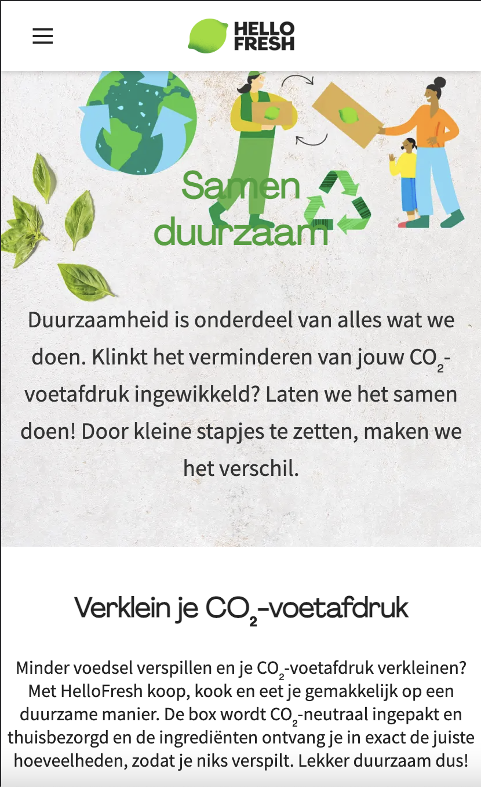
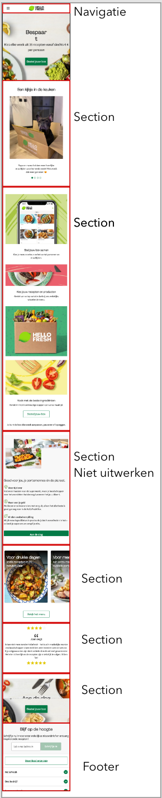
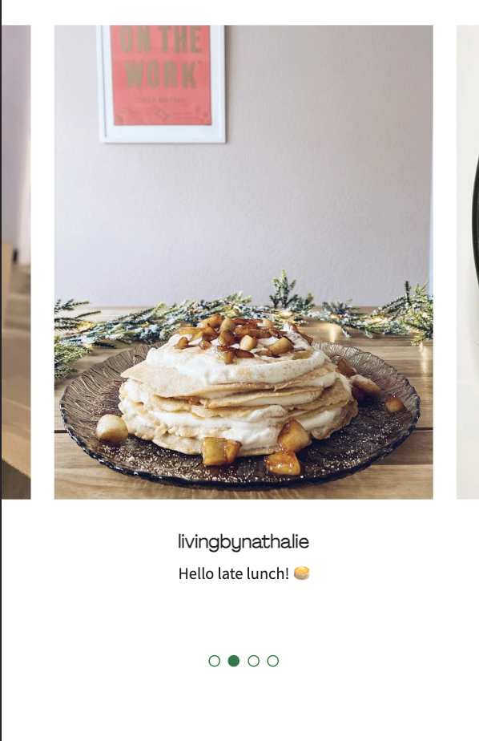

# Procesverslag
Markdown is een simpele manier om HTML te schrijven.  
Markdown cheat cheet: [Hulp bij het schrijven van Markdown](https://github.com/adam-p/markdown-here/wiki/Markdown-Cheatsheet).

Nb. De standaardstructuur en de spartaanse opmaak van de README.md zijn helemaal prima. Het gaat om de inhoud van je procesverslag. Besteedt de tijd voor pracht en praal aan je website.

Nb. Door *open* toe te voegen aan een *details* element kun je deze standaard open zetten. Fijn om dat steeds voor de relevante stuk(ken) te doen.

## Jij

  
uitwerken voor kick-off werkgroep

  ### Auteur:
  Taurese Usman (vervangen door jouw naam)

  #### Je startniveau:
  Blauw (kies uit zwart, rood óf blauw)

  #### Je focus:
  Responsive (kies uit responsive óf surface plane)
 

## Je website

  
uitwerken voor kick-off werkgroep

  ### Je opdracht:
  https://www.hellofresh.nl/

  #### Screenshot(s) van de eerste pagina (small screen): 
  Homepage
   
  

  #### Screenshot(s) van de tweede pagina (small screen):
  Samenduurzaam

  
 

## Toegankelijkheidstest 1/2 (week 1)

  
uitwerken na test in 1e werkgroep

  ### Bevindingen
  Lijst met je bevindingen die in de test naar voren kwamen:

  #### Screenreader
Met een screenreader is de website goed te gebruiken je krijgt alle info goed mee. Alle tekst, navigatie, headers en titels worden goed uitgelegd. 

  #### Muis en Toetsenbord 
Met de muis worden alle klik-bare functies ge-highlight, wanneer je op een button of een carrousel hovert dan krijg word deze een andere kleur en krijgt deze een zwaardere border. 

Hier heeft Hello Fresh goed rekening mee gehouden. 

Tab en enter werken allebei goed, je kan de website hier goed mee bedienen. Alle klik-bare opties worden hiermee snel bereikt bereik.

Met de tab knop kan je direct door de gehele website navigeren en met de enter kan je naar de geselecteerde subpagina komen (die je met de tab hebt geselecteerd).

  #### Motoriek (shocks, elastiekjes)
Slecht motoriek is de website goed te gebruiken, dit is omdat de buttons erg groot zijn. 
Omdat je op de praktisch niet hoeft te typen op de website maakt dit het erg makkelijk. 
Ook is het lezen van de content op de pagina erg nog steeds erg goed te doen. 

Met spasmes of Parkinson’s is de website lastig te gebruiken, maar niet onmogelijk. Omdat de buttons erg groot zijn is het nog mogelijk om hier op te kunnen klikken.  Wel was het navigeren met spasmes erg moeilijk met een hand, maar met twee zou dit nog moeilijker zijn om te gebruiken. 

  #### Concentratie problemen
Concentratieprobleem
Met concentratie problemen is deze website niet zo goed te gebruiken. Dit is omdat de website heel rustig is en geen aandacht trekt wanneer jij met iets andere bezig bent. Er zijn geen onderdelen op de pagina die erg uitspatten. 

  #### Visueel (brillen, contrast, kleurenblind, dark/light). 
Voor mensen met kleurenblind word er best goed rekening gehouden, wanneer er met colorblindly word gekeken dan worden de andere kleuren erg ge-highlight of de kleuren zelfs veranderd. 

Behalve bij de Green-Week of Green-Blind, hierbij zie je geen verschil met de originele website. 

Verder is met een visuele beperking de website nog redelijk goed te gebruiken, dit is omdat er heel veel afbeeldingen zijn op de pagina en dat er goed gebruik is gemaakt van flexbox, alle tekst is opgedeeld in verschillende stukken.

## Breakdownschets (week 1)

  
uitwerken na afloop 2e werkgroep

  ### de hele pagina: 
  

  ### dynamisch deel (bijv menu): 
  

  ### wellicht nog een dynamisch deel (bijv filter): 
  

## Voortgang 1 (week 2)

  
uitwerken voor 1e voortgang

  ### Stand van zaken
  hier dit ging goed & dit was lastig (neem ook screenshots op van delen van je website en code)

  ### Agenda voor meeting
  samen met je groepje opstellen

  | Taurese        | Brianne            | Lars         | student 4        |
  | ---            | ---                | ---          | ---              |
  | List item op   | en dit             | Hoe kan ik   | en dan ik dat    |
  | een timer die  | dit als er tijd is | het beste be |                  |
  | ginnen met cs  | ...                | ginnen met-css|                 |
  
  
  Brianne	student 2	student 3	student 4
Ik kan niet altijd :nth-of-	...	...	...
child gebruiken. Bijv. als ik	...	...	...
de 1e section een background-	...	...	...
image wil geven. Wat moet ik	...	...	...
dan doen? (zelfde met links)

   Ik weet niet hoe
   ik een list item 
   laten veranderen op
   een timer die loopt. 

  ### Verslag van meeting
  hier na afloop snel de uitkomsten van de meeting vastleggen

  - punt 1
  - punt 2
  - nog een punt
  - ...

## Voortgang 2 (week 3)

  
uitwerken voor 2e voortgang

  ### Stand van zaken
  hier dit ging goed & dit was lastig (neem ook screenshots op van delen van je website en code)

  ### Agenda voor meeting
  samen met je groepje opstellen

  | Taurese       | student 2          | student 3    | student 4        |
  | ---            | ---                | ---          | ---              |
  | dit bespreken  | en dit             | en ik dit    | en dan ik dat    |
  | en dat ook nog | dit als er tijd is | nog een punt | dit wil ik zeker |
  | ...            | ...                | ...          | ...              |

  ### Verslag van meeting
  hier na afloop snel de uitkomsten van de meeting vastleggen

  - punt 1
  - punt 2
  - nog een punt
- ...

## Toegankelijkheidstest 2/2 (week 4)

  
uitwerken na test in 8e werkgroep

  ### Bevindingen
  Lijst met je bevindingen die in de test naar voren kwamen (geef ook aan wat er verbeterd is):

  #### Screenreader
  Hier korte omschrijving (met indien nodig afbeeldingen)

  Hier een omschrijving van hoe het opgelost kan worden (met indien nodig afbeeldingen)

  #### Muis en Toetsenbord 
  Hier korte omschrijving (met indien nodig afbeeldingen)

  Hier een omschrijving van hoe het opgelost kan worden (met indien nodig afbeeldingen)

  #### Motoriek (shocks, elastiekjes)
  Hier korte omschrijving (met indien nodig afbeeldingen)

  Hier een omschrijving van hoe het opgelost kan worden (met indien nodig afbeeldingen)

  #### Visueel (brillen, contrast, kleurenblind, dark/light). 
  Hier korte omschrijving (met indien nodig afbeeldingen)

  Hier een omschrijving van hoe het opgelost kan worden (met indien nodig afbeeldingen)

## Voortgang 3 (week 4)

  
uitwerken voor 3e voortgang

  ### Stand van zaken
  hier dit ging goed & dit was lastig (neem ook screenshots op van delen van je website en code)

  ### Agenda voor meeting
  samen met je groepje opstellen

  | student 1      | student 2          | student 3    | student 4        |
  | ---            | ---                | ---          | ---              |
  | dit bespreken  | en dit             | en ik dit    | en dan ik dat    |
  | en dat ook nog | dit als er tijd is | nog een punt | dit wil ik zeker |
  | ...            | ...                | ...          | ...              |

  ### Verslag van meeting
  hier na afloop snel de uitkomsten van de meeting vastleggen

  - punt 1
  - punt 2
  - nog een punt
  - ...

## Eindgesprek (week 5)

  
uitwerken voor eindgesprek

  ### Je uitkomst - karakteristiek screenshots:
  

  ### Dit ging goed/Heb ik geleerd: 
  Korte omschrijving met plaatjes

  

  ### Dit was lastig/Is niet gelukt:
  Korte omschrijving met plaatjes

  

## Bronnenlijst

  
continu bijhouden terwijl je werkt

  Nb. Wees specifiek ('css-tricks' als bron is bijv. niet specifiek genoeg).

  1. bron 1
  2. bron 2
  3. ...

